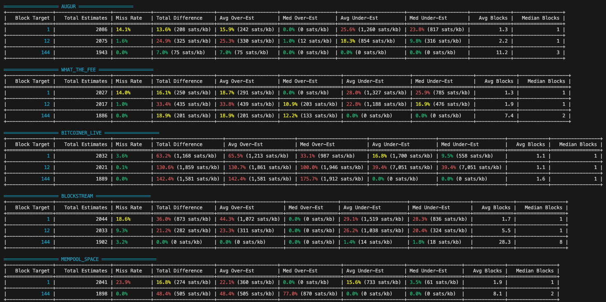

# Bitcoin Fee Estimator Backtest Tool

A minimal Python tool to reproduce Bitcoin fee estimator benchmark results using exported CSV data.

## Overview

This tool compares fee estimation strategies from different providers (AUGUR, WHAT_THE_FEE, BITCOINER_LIVE, BLOCKSTREAM, MEMPOOL_SPACE) by simulating their performance against historical block data. Its original purpose was to benchmark the performance of Block's open-source fee estimator, [Augur](https://github.com/block/bitcoin-augur).

## Setup

1. Install dependencies:
```bash
pip install -r requirements-backtest.txt
```

2. Obtain block fee and provider data.
  - You can use our sample sample data from June 1, 2025 - July 1, 2025 that includes:
     - `block_fees.csv` - Historical block fee percentiles
     - `fee_provider_estimates.csv` - Fee estimates from providers
  - To do so, run these commands:
  ```bash
  mkdir data && cd data && \
  curl -O https://pricing.bitcoin.block.xyz/benchmark_data_2025_jan_jun.zip && \
  unzip benchmark_data_2025_jan_jun.zip && \
  rm benchmark_data_2025_jan_jun.zip && \
  cd ..
  ```
## Usage

Basic usage:
```bash
python backtest.py --start-date 2025-05-02 --end-date 2025-05-15
```

With specific providers:
```bash
python backtest.py --start-date 2025-05-02 --end-date 2025-05-15 --providers AUGUR,WHAT_THE_FEE
```

Custom data files:
```bash
python backtest.py --start-date 2025-05-02 --end-date 2025-05-15 \
  --block-data path/to/blocks.csv --provider-data path/to/providers.csv
```

As an example, the following command should produce the following output:
```bash
python backtest.py --start-date 2025-05-02 --end-date 2025-05-15
```


## Output

The tool outputs a performance table showing:
- **Miss Rate**: Percentage of estimates that wouldn't confirm in target time
- **Over-estimation**: How much fees were overestimated (avg/median)
- **Under-estimation**: How much fees were underestimated (avg/median) 
- **Confirmation Time**: Average/median blocks needed to confirm

## Methodology

The backtest simulates real-world usage by:

1. For each historical block, finding fee estimates made shortly after the previous block
2. Calculating the minimum fee needed to confirm within the target window (using 5th percentile)
3. Determining if estimates would have resulted in timely confirmation
4. Tracking over/under-estimation relative to the 75th and 5th percentile thresholds, respectively

## Providers Tested

| Provider | 1 Block | 12 Blocks | 144 Blocks |
|----------|---------|-----------|------------|
| AUGUR | 3 | 12 | 144 |
| WHAT_THE_FEE | 3 | 12 | 144 |
| BLOCKSTREAM | 2, 3 | 10 | 144 |
| MEMPOOL_SPACE | fastestFee (2), halfHourFee (3) | — | economyFee (144) |
| BITCOINER_LIVE | 30 minutes | 120 minutes | 1440 minutes |

**Note**: Block targets 2 and 3 are normalized to 1, and block target 10 is normalized to 12 for consistent comparison across providers. These mappings and the chosen target estimates stored in `fee_provider_estimates.csv` were specific to our use case. For more comprehensive target estimate offerings, refer to the original API outputs:
- AUGUR - `curl https://pricing.bitcoin.block.xyz/fees`
- WHAT_THE_FEE `curl https://whatthefee.io/data.json`
- BLOCKSTREAM `curl https://blockstream.info/api/fee-estimates`
- MEMPOOL_SPACE `curl https://mempool.space/api/v1/fees/recommended`
- BITCOINER_LIVE `curl https://bitcoiner.live/api/fees/estimates/latest`
